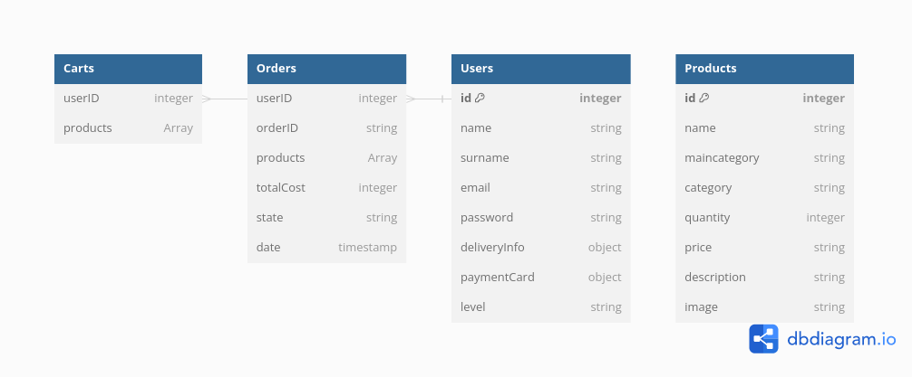

# in&out - E-commerce for indoor and outdoor design

### Web Development course project - 2022/2023

## Introduction

*in&out* is an e-commerce developed in HTML5, CSS3, Javascript, Node.js and MongoDB for Web development course project.

### Database schema

Database is designed in order to make the handling of the application data as easier as possible. Dividing Orders and Carts collections from Users made easier to manage API calls for administrator management and a better scalability, but increased the number of API calls needed to achieve certain tasks.

## Usage

##### Install `npm` and execute `npm i` for installing all dependencies; then execute `npm start` to start the server and go to http://localhost:3000/ for accessing the homepage or to http://localhost:3000/adminhandler for the administrator handler page.

## Author

Giovanni Campo